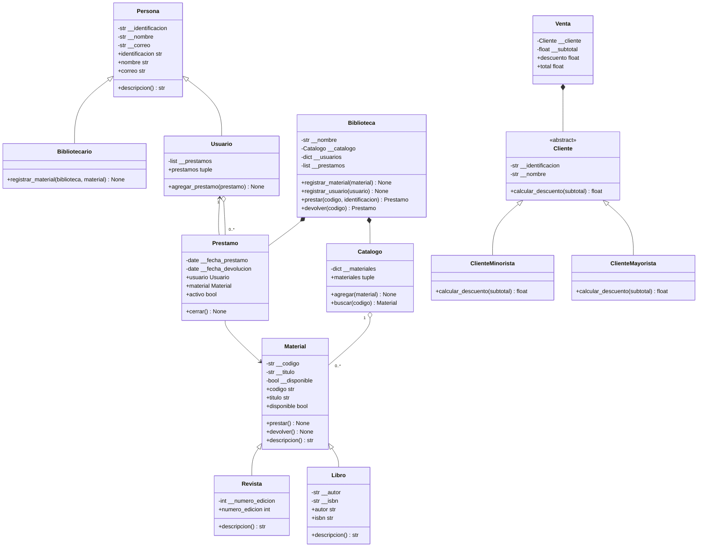

# Diagrama UML

El siguiente diagrama se puede visualizar en cualquier visor compatible con Mermaid, por ejemplo Mermaid Live Editor o GitHub:

```mermaid
classDiagram
    class Persona {
        -str __identificacion
        -str __nombre
        -str __correo
        +identificacion str
        +nombre str
        +correo str
        +descripcion() str
    }

    class Usuario {
        -list __prestamos
        +prestamos tuple
        +agregar_prestamo(prestamo) None
    }

    class Bibliotecario {
        +registrar_material(biblioteca, material) None
    }

    class Material {
        -str __codigo
        -str __titulo
        -bool __disponible
        +codigo str
        +titulo str
        +disponible bool
        +prestar() None
        +devolver() None
        +descripcion() str
    }

    class Libro {
        -str __autor
        -str __isbn
        +autor str
        +isbn str
        +descripcion() str
    }

    class Revista {
        -int __numero_edicion
        +numero_edicion int
        +descripcion() str
    }

    class Catalogo {
        -dict __materiales
        +materiales tuple
        +agregar(material) None
        +buscar(codigo) Material
    }

    class Prestamo {
        -date __fecha_prestamo
        -date __fecha_devolucion
        +usuario Usuario
        +material Material
        +activo bool
        +cerrar() None
    }

    class Biblioteca {
        -str __nombre
        -Catalogo __catalogo
        -dict __usuarios
        -list __prestamos
        +registrar_material(material) None
        +registrar_usuario(usuario) None
        +prestar(codigo, identificacion) Prestamo
        +devolver(codigo) Prestamo
    }

    class Cliente {
        <<abstract>>
        -str __identificacion
        -str __nombre
        +calcular_descuento(subtotal) float
    }

    class ClienteMayorista {
        +calcular_descuento(subtotal) float
    }

    class ClienteMinorista {
        +calcular_descuento(subtotal) float
    }

    class Venta {
        -Cliente __cliente
        -float __subtotal
        +descuento float
        +total float
    }

    Persona <|-- Usuario
    Persona <|-- Bibliotecario
    Material <|-- Libro
    Material <|-- Revista
    Biblioteca *-- Catalogo
    Biblioteca *-- Prestamo
    Prestamo --> Usuario
    Prestamo --> Material
    Usuario "1" o-- "0..*" Prestamo
    Catalogo "1" o-- "0..*" Material
    Cliente <|-- ClienteMayorista
    Cliente <|-- ClienteMinorista
    Venta *-- Cliente
```
